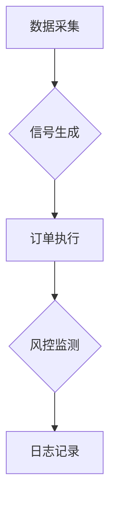

# 加密货币交易策略模板：从零构建币安量化交易体系

## 一、构建高效交易策略的核心要素

在加密货币市场中，系统化的交易策略是稳定盈利的关键。通过结构化框架，交易者可以规避情绪干扰，实现可复制、可优化的交易行为。以下是构建交易策略的六大核心模块：

### 1. 市场分析三维模型
- **技术分析**：运用移动平均线（MA）、相对强弱指数（RSI）、布林带等指标捕捉价格规律。例如当BTC日线级别RSI跌破30时，可能触发超卖反弹信号。
- **基本面分析**：评估项目团队实力、技术路线、社区活跃度等。以DeFi项目为例，TVL（总锁仓量）增长率超过50%可视为积极信号。
- **链上数据**：通过链上分析平台监测大额转账、持币地址分布等。当ETH巨鲸地址突然转移10万枚以上代币时，可能预示市场波动。

### 2. 精准入场规则
- **量化触发条件**：设置多指标共振机制，如"4小时MACD金叉+RSI>50+突破100周期均线"
- **订单类型选择**：
  | 订单类型 | 适用场景 | 滑点控制 |
  |---|---|---|
  | 市价单 | 趋势突破 | 高 |
  | 限价单 | 区间震荡 | 中 |
  | 止损限价单 | 突发行情 | 低 |

### 3. 止损止盈策略
- **动态止损公式**：ATR（14）值的1.5倍作为止损幅度
- **分层止盈设计**：
  ```text
  基础止盈：成本价+3% → 锁定安全边际
  追踪止盈：突破前高后启动2%追踪止损
  ```

👉 [探索更多交易工具](https://bit.ly/okx_welcome)

## 二、币安平台策略构建实战指南

### 1. 策略交易工具矩阵
- **网格交易**：适合震荡行情，参数设置示例：
  ```text
  价格区间：$25,000-$30,000
  网格数量：10格
  单格利润：2%
  ```
- **现货均摊**：熊市定投策略，设置每日/每周固定金额买入BTC

### 2. API自动化交易系统
构建完整交易机器人的核心模块：


### 3. 合约交易风险管理
杠杆使用黄金比例：
| 账户规模 | 建议杠杆 | 单笔风险 |
|---|---|---|
| <$1万 | 5x | 1% |
| $1-10万 | 10x | 0.5% |
| >$10万 | 20x | 0.2% |

👉 [提升交易效率](https://bit.ly/okx_welcome)

## 三、基于RSI的实战交易模板

### 1. 策略参数配置表
| 模块 | 参数设置 | 说明 |
|---|---|---|
| 市场分析 | BTC/USDT 4小时图 | 结合100周期MA |
| 入场规则 | RSI<30 + 价格站稳MA | 单笔投入$200 |
| 止损设置 | 成本价-5% | 挂单自动触发 |
| 止盈机制 | RSI>70分两批平仓 | 50%仓位+移动止损 |

### 2. 策略优化方向
- 时间周期组合：1小时图开仓+日线图过滤趋势
- 风险动态调整：根据VIX指数波动率调整仓位规模
- 多币种联动：BTC/ETH相关性达到0.8时启动套利

## 四、常见问题解答

**Q1：如何判断策略失效？**
A：当连续3次交易未达预期目标，或夏普比率低于0.5时需重新评估

**Q2：新手应该从哪种策略开始？**
A：推荐从现货网格交易入门，建议初始设置10格/1%利润率参数

**Q3：自动化交易需要哪些技术准备？**
A：基础Python编程+API接口调试+历史回测验证，建议先使用模拟账户测试

**Q4：如何设置合理的止损？**
A：波动率自适应止损公式：止损幅度=ATR(14)×1.5，动态调整更有效

**Q5：多交易所套利需要注意什么？**
A：重点监控跨平台价差、转账时间、手续费总成本三个核心要素

👉 [掌握进阶技巧](https://bit.ly/okx_welcome)

## 五、持续优化与风险控制

建立策略健康度评估体系：
```text
1. 每周复盘：检视胜率/盈亏比/最大回撤
2. 季度迭代：根据市场周期调整参数
3. 年度审计：评估策略夏普比率和索提诺比率
```
