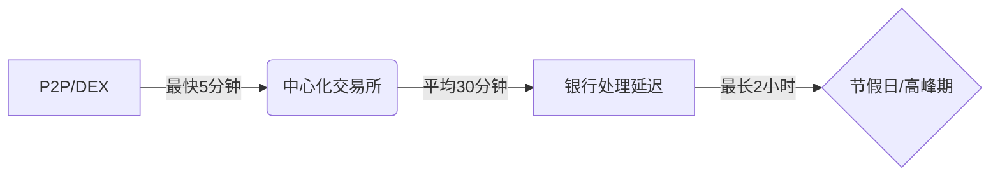

# 如何用信用卡购买比特币

## 信用卡购买比特币的可行性解析

在加密货币投资领域，信用卡支付因其便捷性成为许多用户的首选。但需要注意，**并非所有银行和交易平台都支持该支付方式**。Visa等国际卡组织虽允许部分交易，但具体执行需以发卡行政策为准。通过第三方支付网关（如Cryptomus）可实现法币与BTC的快速兑换，这类平台作为中介保障交易安全。

👉 [立即体验合规加密交易服务](https://bit.ly/okx_welcome)

### 支持信用卡交易的主流平台
| 平台类型       | 安全性评级 | 匿名性 | 新手友好度 | 典型手续费范围 |
|----------------|------------|--------|------------|----------------|
| 中心化交易所   | 高         | 中等   | 高         | 1.5%-3.8%     |
| P2P交易平台    | 中等       | 低     | 中等       | 2%-5%         |
| 去中心化交易所 | 高         | 高     | 低         | 0.1%-1%       |
| 在线钱包服务商 | 中等       | 低     | 高         | 3%-5%         |

## 核心注意事项与风险规避

### 费用结构深度解析
1. **平台手续费**：主流交易所收取0.1%-3%不等的交易费，OKX等头部平台常提供阶梯折扣
2. **支付渠道附加费**：信用卡支付通常产生3%-5%溢价，部分平台收取0.5%-1.5%点差
3. **银行额外收费**：注意发卡行可能加收1%-3%跨境交易费，建议优先使用本币结算账户

👉 [查看全球零手续费交易平台](https://bit.ly/okx_welcome)

### 资金限额机制
- **新手账户**：单日限额普遍在$500-$2000区间
- **高级认证用户**：多数平台开放至$10,000+/日
- **提额技巧**：完成视频认证、绑定社交媒体账户可加速额度提升

### 资金到账时效对比

## 分步操作指南（Cryptomus平台）

### 账户准备阶段
1. 使用Google/Telegram账号快速注册
2. 启用Google Authenticator双重验证
3. 完成KYC认证：
   - 上传身份证/护照清晰扫描件
   - 拍摄持证自拍（需清晰显示面部及证件信息）

### 交易执行流程
1. 进入"资产"页面选择BTC
2. 点击"法币充值"选择信用卡通道
3. 输入目标金额自动换算BTC数量
4. 通过邮箱验证码确认交易
5. 填写信用卡CVV安全码完成支付

## 常见问题解答

### 信用卡购买的BTC如何转账？
购买成功后需先提币至个人钱包。操作路径：资产-提币-选择BTC网络-输入外部钱包地址。注意选择正确的区块链网络（如BTC主网），避免资产损失。

### 无验证账户能否交易？
极少数平台允许小额免验证交易（如LocalBitcoins），但单日限额低于$500且风险较高。建议优先选择完成KYC的合规平台保障资金安全。

### 支付失败常见原因？
- 信用卡未开通在线支付功能
- 超出单日交易次数/金额限制
- 银行风控系统拦截（建议联系客服开通数字资产交易权限）

👉 [获取7x24小时支付解决方案](https://bit.ly/okx_welcome)

## 安全防护建议

1. 启用设备指纹登录验证
2. 定期更换交易密码（建议90天周期）
3. 使用硬件钱包存储大额资产
4. 开启异常登录通知提醒
5. 警惕钓鱼网站（始终通过官方渠道访问平台）

通过信用卡投资比特币时，建议单笔交易金额控制在信用卡可用额度的30%以内，避免影响个人征信记录。新手投资者可先通过模拟交易熟悉流程，再逐步增加投资规模。