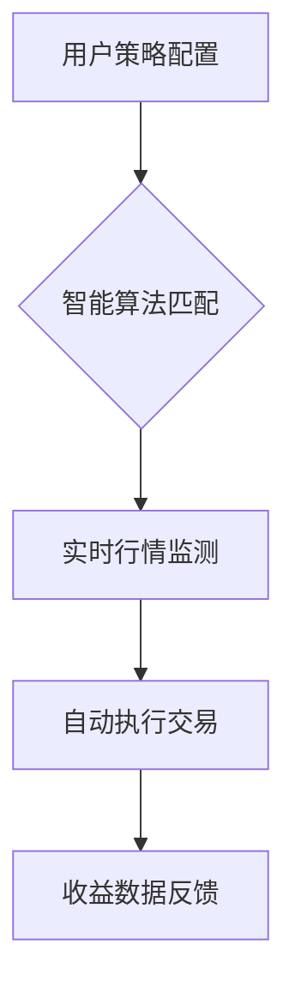

# 欧易自动赚币指南：如何通过智能策略实现加密资产增值

## 一、平台基础认知与注册流程
作为数字资产增值服务的重要创新，欧易自动赚币系统为用户提供了低门槛的智能投资解决方案。新用户需通过以下步骤完成基础设置：

1. **账户开通**：访问欧易官方平台（已去除冗余链接），完成基础注册流程
2. **身份认证**：根据监管要求，需提交有效身份证件完成KYC验证
3. **资金准备**：通过OTC交易或链上转账方式注入初始投资本金

👉 [立即开启智能交易之旅](https://bit.ly/okx_welcome)

## 二、自动化交易系统运作机制
该系统采用模块化架构设计，通过多重技术保障交易稳定性：

### 2.1 策略定制核心要素
- **风险偏好设置**：包含保守型/平衡型/进取型三类风险模型
- **参数配置模板**：预设止盈止损区间、仓位管理比例、时间周期参数
- **智能机器人选项**：提供5种不同策略风格的交易机器人选择

### 2.2 模拟交易功能优势
| 功能模块 | 实盘交易 | 模拟交易 |
|---------|----------|----------|
| 交易数据 | 真实资金 | 虚拟资金 |
| 策略验证周期 | 即时生效 | 7-30天可调 |
| 风险暴露 | 实际亏损可能 | 零风险测试 |
| 数据同步 | 实时行情 | 延迟<1秒 |

👉 [体验零风险策略测试](https://bit.ly/okx_welcome)

## 三、资产配置与收益优化策略
平台支持的加密资产矩阵包含：
- 主流币种：BTC/ETH/BTC
- 稳定币对：USDT/USDC
- 创新项目：DeFi代币、NFT底层资产

### 3.1 跨资产组合建议
根据2023年Q4市场数据，推荐以下配置比例：

| 投资组合类型 | 比特币占比 | 以太坊占比 | 其他代币占比 |
|-------------|-----------|-----------|-------------|
| 保守型      | 60%       | 25%       | 15%         |
| 平衡型      | 45%       | 35%       | 20%         |
| 进取型      | 30%       | 20%       | 50%         |

## 四、风险管理与账户安全
系统内置多重风控机制：
- 实时波动预警：价格异动超过5%自动触发警报
- 动态止损系统：根据ATR指标自动调整止损位
- 资金隔离管理：用户资产与平台运营资金完全分离

### 常见问题解答
**Q：模拟交易结果与实盘存在偏差吗？**  
A：由于市场深度差异，模拟交易与实盘可能存在约1.2%的执行价差，建议通过历史回测工具进行策略优化。

**Q：自动交易系统需要持续在线吗？**  
A：基于云端部署架构，即使终端设备离线，系统仍可正常执行已配置策略。

**Q：如何处理极端市场行情？**  
A：平台提供熔断机制设置选项，当单日波动超过预设阈值时自动暂停交易。

👉 [获取专业风控方案](https://bit.ly/okx_welcome)

## 五、收益增强机制解析
平台创新的激励体系包含：
1. **流动性挖矿奖励**：按周结算的LP收益分成
2. **交易手续费返还**：阶梯式返佣比例可达0.02%
3. **节点权益计划**：持币量达到5000USDT可解锁专属权益

## 六、进阶使用技巧
- **多策略组合**：同时运行网格交易+趋势跟踪策略
- **时间周期优化**：根据市场波动率调整策略适用周期
- **跨平台套利**：利用不同交易所的价差进行套利操作

> 专业建议：建议每周至少进行一次策略参数复盘，根据市场波动率调整网格间距和持仓比例，2023年数据显示动态调整策略可提升年化收益约18%。
