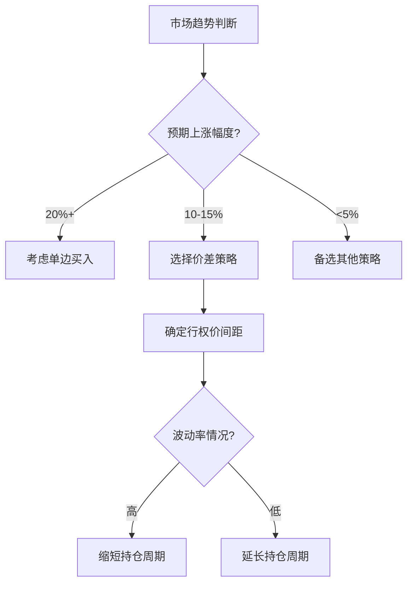

# 看涨价差策略详解

## 策略核心概念
看涨价差策略（Bull Call Spread）是期权交易中基础且实用的组合策略，适用于预期市场温和上涨时的风险管理场景。该策略通过买入低行权价看涨期权并卖出高行权价看涨期权，构建具有成本优势和风险保护的交易组合。

👉 [立即掌握期权交易实战技巧](https://bit.ly/okx_welcome)

### 核心要素解析
1. **双向操作**：同步执行买入与卖出操作
2. **行权价差异**：两个期权行权价存在合理价差
3. **期限一致**：组合内期权到期日完全相同
4. **标的统一**：交易品种必须为同一资产

---

## 盈利逻辑与适用场景

### 盈利机制
策略收益呈现阶梯式特征：
- 最大盈利 = 行权价差额 - 净权利金支出
- 最大亏损 = 净权利金支出
- 盈亏平衡点 = 低行权价 + 净权利金

### 市场环境要求
| 市场趋势 | 波动率 | 适用性 |
|----------|--------|--------|
| 温和上涨 | 中等   | ★★★★★ |
| 剧烈波动 | 高     | ★★☆☆☆ |
| 单边下跌 | 低     | ☆☆☆☆☆ |

👉 [把握牛市期权组合配置时机](https://bit.ly/okx_welcome)

### 交易者画像
- 预期标的资产温和上涨
- 愿意承担有限风险
- 寻求比单边买入期权更优风险收益比
- 需要控制权利金支出

---

## 交易执行关键点

### 构建条件清单
1. 确认标的资产相同
2. 选择相同到期日（建议2-3个月期限）
3. 确保行权价间距合理（通常5-10%价差）
4. 保持数量一致（1:1比例最常见）
5. 交易方向相反（买入+卖出组合）

### 成本计算模型
```text
净权利金 = 买入期权费 - 卖出期权费
保证金要求（卖方）：行权价差 × 合约单位 - 净权利金
```

### 风险收益特征
| 指标         | 多头策略       | 单边买入对比 |
|--------------|----------------|--------------|
| 最大亏损     | 净权利金       | 全额权利金   |
| 最大盈利     | 有限收益       | 理论无限     |
| 成本优势     | 降低30-50%     | 基础成本     |
| 风险控制     | 明确止损点     | 无自动止盈   |

👉 [深度解析期权策略成本结构](https://bit.ly/okx_welcome)

---

## 实战交易案例分析

### 比特币期权操作实例
**构建参数：**
- 低行权价：$60,000（买入）
- 高行权价：$70,000（卖出）
- 权利金支出：$2,000（买入） - $1,000（卖出） = $1,000
- 标的现价：$60,000

### 三种市场情景模拟
| 情景        | 标的价格 | 总收益计算                  | 收益率   |
|-------------|----------|-----------------------------|----------|
| 极端下跌    | $50,000  | -$1,000（权利金净损失）     | -100%    |
| 温和上涨    | $65,000  | ($5,000行权收益 + $1,000权利金)| +400%    |
| 强势突破    | $75,000  | $15,000行权收益 - $4,000损失  | +1,300%  |

### 交易决策树


---

## 常见问题解答

**Q：什么情况下不适合使用该策略？**  
A：当市场出现剧烈波动预期或存在重大利好/利空消息时，策略的盈利空间受限特性可能影响收益。

**Q：如何选择行权价间距？**  
A：通常参考标的资产波动率，建议间距为当前价格的5-10%。比特币等高波动资产可适当放宽至15-20%。

**Q：能否中途调整策略？**  
A：在有效期内可通过平仓部分头寸调整风险敞口，但会改变原有收益结构。建议在建仓前做好压力测试。

**Q：保证金要求如何计算？**  
A：卖方需缴纳保证金=（行权价差×合约单位）- 净权利金。具体比例需参考交易所规定。

**Q：提前平仓是否划算？**  
A：当标的涨幅达到行权价差的70-80%时，提前平仓可能更优。需综合时间价值损耗评估。

---

## 策略优化进阶

### 波动率交易技巧
- **隐含波动率高位**：选择卖出期权端
- **波动率贴水时**：延长持仓周期
- **波动率曲面倾斜**：利用偏度调整行权价

### 动态调整策略
| 市场变化       | 应对措施                 |
|----------------|--------------------------|
| 快速上涨突破   | 平仓止盈或转换为日历价差 |
| 意外暴跌       | 转换为保护性认沽组合     |
| 波动率骤升     | 加仓卖出虚值期权         |
| 趋势反转预期   | 反向价差对冲             |

### 组合扩展应用
- 与认沽价差组合构建箱体策略
- 结合现货持仓形成备兑认购
- 与波动率产品进行对冲

---

**风险提示**：期权交易存在市场风险、流动性风险及保证金风险，建议新手投资者先通过模拟交易熟悉策略特性。投资决策前应充分评估自身风险承受能力。

👉 [获取专业期权策略分析工具](https://bit.ly/okx_welcome)