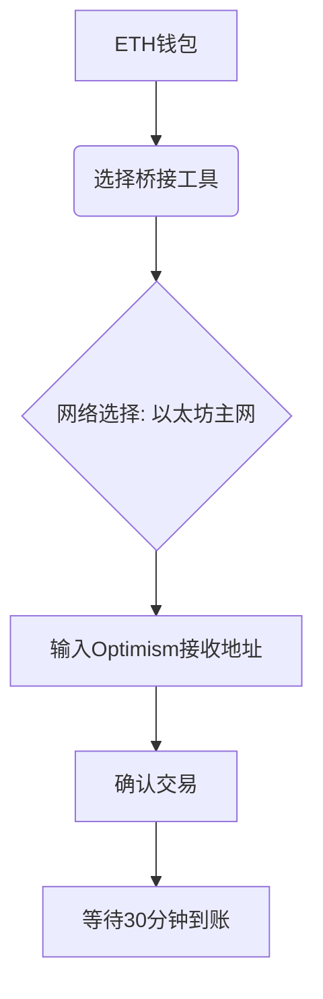

# 详解支持OpenSea的区块链Optimism：NFT生态与空投机遇全解析

## Optimism区块链的核心优势

### 以太坊Layer2的创新实践
作为以太坊的第二层扩展解决方案，Optimism通过**Optimistic Rollup**技术实现革命性突破。该技术将交易数据批量处理后提交至以太坊主链，既保证安全性又显著提升效率。相比传统以太坊网络，其交易速度提升达10-100倍，Gas费降低至1/100，彻底解决区块链可扩展性难题。

👉 [立即体验Optimism生态](https://bit.ly/okx_welcome)

### 技术架构解析
1. **欺诈证明机制**：采用"先验证后验证"模式，正常交易即时确认，异常交易通过7天争议期解决
2. **数据可用性保障**：所有交易数据永久存储在以太坊主链，确保不可篡改性
3. **EVM兼容性**：完全支持Solidity智能合约，开发者可无缝迁移以太坊应用

### 生态发展数据
| 指标                | Optimism | 以太坊主网 |
|---------------------|----------|------------|
| 平均交易确认时间    | 2秒      | 13-15分钟  |
| Gas费（USD）        | $0.001   | $50+       |
| TVL（总锁定价值）   | $8.2亿   | $150亿     |
| 日均交易量          | 120万笔  | 150万笔    |

## Optimism空投奖励机制全解析

### 首期空投（Airdrop 1）回顾
2022年3月实施的首次空投创造了区块链历史上的经典案例：
- **基础奖励**：2469.35 OP（约$32,000）
- **多条件叠加**：最高可达**50,000 OP**
- **激励对象**：早期用户/重复使用者/DAO参与者/多重签名者/Gitcoin捐赠者

👉 [查看最新空投机会](https://bit.ly/okx_welcome)

### 持续性空投策略
1. **Optimistic Explorer计划**：完成基础链桥接操作即可获得NFT
2. **Galxe任务系统**：通过18项任务收集Quest NFT，累积参与度
3. **动态空投机制**：根据链上活跃度实时调整奖励分配

### 参与空投完全指南
1. 注册MetaMask等兼容钱包
2. 完成ETH到Optimism的桥接
3. 在Quix等平台进行NFT交易
4. 参与DAO治理投票
5. 关注官方Galxe任务发布

## 优质NFT收藏品推荐

### 现象级项目解析
| 项目名称             | 特点                                 | 当前地板价(ETH) | 稀有度机制 |
|----------------------|--------------------------------------|----------------|------------|
| Apetimism            | 3D猿类PFP，元宇宙布局                | 0.8            | 属性叠加   |
| OptiPunks            | CryptoPunks致敬项目，100%公益捐赠    | 1.2            | 稀有头饰   |
| Optimistic Bunnies   | 首发兔型NFT，动态生成特性            | 0.5            | 背景变异   |
| Ganland              | AI生成奇幻世界，实体周边联动         | 0.3            | 元素组合   |

### 新兴潜力项目
- **OP Cat**：基于社区治理的猫咪养成游戏
- **Optimism OG**：早期贡献者认证NFT
- **SolarPunks**：可持续发展主题科幻艺术

## 全流程操作指南

### 第一步：准备ETH资产
1. 通过合规交易所购买ETH（推荐GMO Coin）
2. 提现至MetaMask等兼容钱包
3. 设置钱包安全验证（建议启用2FA）

### 第二步：链桥接操作
使用官方推荐的桥接工具：
1. **Optimism Bridge**：安全可靠，适合新手
2. **Hop Exchange**：手续费返利OP代币
3. **Chainswap**：支持多链互换

操作流程：

### 第三步：NFT交易实战
1. 连接钱包至Quix/OpenSea/tofuNFT
2. 浏览热门榜单（推荐关注#Optimism500排行榜）
3. 参与拍卖/直接购买/创建个人NFT
4. 设置价格提醒和收藏夹通知

## 市场平台深度对比

### 三大平台功能矩阵
| 平台        | 原生支持 | 多链支持 | 社区活动 | 用户量  | 特色功能               |
|-------------|----------|----------|----------|---------|------------------------|
| Quix        | ✅        | ❌        | 高       | 50万+   | 空投奖励系统           |
| OpenSea     | ✅        | ✅        | 中       | 600万+  | 跨链交易聚合           |
| tofuNFT     | ✅        | ✅        | 低       | 200万+  | 日本市场本地化支持     |

### 选择建议
- 新手入门：优先选择Quix，参与官方教育计划
- 资深玩家：使用OpenSea跨链套利
- 日本用户：tofuNFT提供本地化服务

## 常见问题解答

**Q：Optimism与其他Layer2方案有何区别？**
A：其独特之处在于：
1. 更低的Gas费波动（<0.1美元）
2. 与以太坊主网100%兼容
3. 专注NFT和DeFi生态建设

**Q：如何最大化空投收益？**
A：建议组合策略：
- 保持每周至少3次链上交互
- 参与至少3个DApp
- 持有5个以上不同项目NFT
- 定期参与DAO治理

**Q：桥接资金是否安全？**
A：官方桥接工具经过CertiK审计，建议：
- 单次转账不超过50ETH
- 定期检查交易记录
- 启用钱包通知提醒

**Q：NFT存储是否需要额外费用？**
A：无需持续费用，但：
- 首次铸造需支付Gas
- 转账/出售产生手续费
- 推荐使用IPFS存储方案

**Q：如何参与项目治理？**
A：主要路径：
1. 持有OP代币（最低1枚）
2. 在Snapshot平台投票
3. 提交治理提案（需5万OP）
4. 加入社区Discord讨论

## 未来发展趋势

### 技术升级路线
- **OP Stack 2.0**：2024Q2推出模块化架构
- **ZK-Rollup混合方案**：结合零知识证明提升安全性
- **Cosmos跨链桥**：2025年实现跨生态互通

### 生态扩张计划
1. 引入50+新DApp（2024）
2. 建立亚洲开发者基金（$5000万）
3. 与传统IP合作推出实体NFT

### 价值投资展望
- **代币经济学改革**：2024年实施销毁机制
- **机构投资者入场**：贝莱德等已提交相关ETF
- **应用场景扩展**：从NFT向GameFi、DeFi延伸

👉 [把握未来投资机遇](https://bit.ly/okx_welcome)

## 结语：抢占Web3.0新高地

Optimism正在重塑区块链应用范式，其独特的技术架构和活跃的社区生态为早期参与者创造了巨大机遇。通过本文的系统解析，读者可全面掌握：
- 高效参与空投的完整策略
- NFT投资的科学决策模型
- 多平台套利的操作技巧
- 未来趋势的前瞻判断

建议立即实践：
1. 完成本文提到的3步入门流程
2. 参与当前Galxe任务
3. 关注Quix平台首发项目
4. 定期查看官方治理提案

在Web3.0的浪潮中，Optimism生态的先行者优势正在显现，现在正是布局的黄金窗口期。