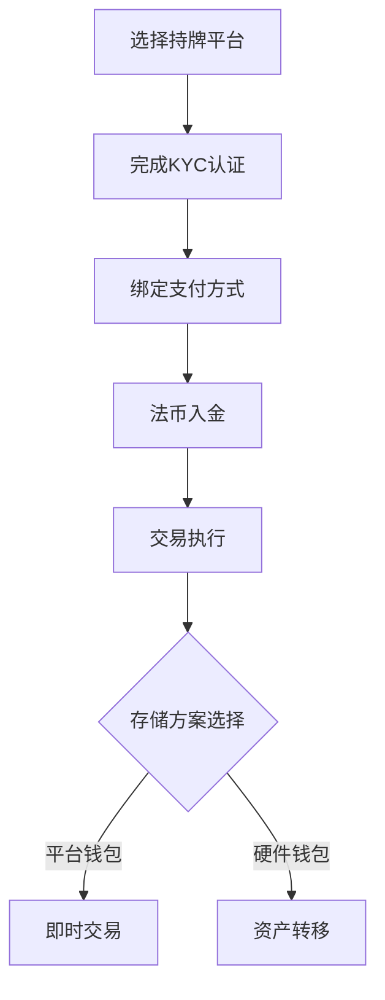

# 香港比特币交易所推荐：2025年6大最佳平台指南

## 香港加密货币投资全景解析

在香港购买比特币和主流加密货币已成为便捷的数字资产配置方式。通过合规平台完成实名认证后，投资者最快10分钟即可完成首笔交易。随着区块链技术的普及，本地化交易平台持续优化移动端体验，支持7×24小时全球市场交易。

对于长期投资者，建议将资产转移至硬件钱包存储。而追求流动性的用户，主流交易所提供的即时代币兑换服务能有效降低入场门槛。值得关注的是，Peer-to-Peer交易模式为专业投资者提供了无需KYC的替代方案，但操作复杂度较高。

---

### 1\. AvaTrade：持牌合规的综合交易平台

| 维度        | 特点描述                                                                 |
|-------------|--------------------------------------------------------------------------|
| 监管资质    | 拥有欧盟MiFID、英国FCA等多国金融牌照，合规性行业领先                    |
| 产品矩阵    | 覆盖外汇、股指、大宗商品等600+交易品种，加密货币提供BTC/USD等15对交易对 |
| 费用结构    | 点差制收费，无交易佣金，隔夜持仓费0.03%-0.1%                           |
| 新手友好度  | 提供模拟账户和视频教程，支持中文界面                                     |
| 风险提示    | 仅提供差价合约（CFD）交易，不支持实物交割                               |

👉 [开启合规交易之旅](https://bit.ly/okx_welcome)

---

### 2\. Binance：全球领先的加密货币生态

作为全球最大数字资产交易平台，Binance凭借以下优势持续领跑行业：

- **流动性优势**：日均交易量超200亿美元，BTC/USDT交易对深度行业前三
- **生态建设**：包含DeFi、NFT、Launchpad等完整区块链服务矩阵
- **费用体系**：基础费率0.1%，持有BNB可享最高50%手续费减免
- **创新功能**：首创双币投资、自动复利等智能投资工具

> "Binance的智能链技术推动了DeFi应用的爆发式增长，为开发者提供低手续费的基础设施支持"

---

### 3\. Skilling：欧洲新锐交易平台

| 核心优势         | 实施细节                                                                 |
|------------------|--------------------------------------------------------------------------|
| 监管框架         | 受塞浦路斯CySEC监管（许可证号365/18），符合欧盟MiFID标准                |
| 交易工具         | 提供MetaTrader 4/5、cTrader等主流平台，支持EA自动化交易                  |
| 客户服务         | 7×24小时多语言支持，平均响应时间<2分钟                                   |
| 教育资源         | 提供Trading Central市场分析工具和100+教学视频                           |

---

### 4\. Bitstamp：老牌交易所的稳健选择

成立时间：2010年（伦敦金融城注册）
安全保障：冷存储98%资产，投保1亿美元数字资产保险
特色服务：机构级API接口，支持高频交易
合规认证：通过ISO 27001信息安全管理体系认证

---

### 5\. Kraken：美国合规标杆

- **监管资质**：美国首个获得银行牌照的加密货币交易所
- **产品特色**：支持法币直接交易的稳定币（USD Coin）、质押年化收益达4-6%
- **技术创新**：开发加密货币期权清算系统，获得美国专利局认证
- **社会责任**：承诺2025年前实现碳中和运营

---

### 6\. OKX：全球化数字资产枢纽

| 维度        | 数据表现                          |
|-------------|-----------------------------------|
| 用户规模    | 覆盖全球200+国家，注册用户超5000万 |
| 产品矩阵    | 覆盖现货、期货、期权、Web3钱包等   |
| 技术架构    | 自研高并发撮合引擎，TPS达200万     |
| 合规进展    | 获得马耳他MGA、日本JFSA等多国牌照 |

👉 [体验全球化交易服务](https://bit.ly/okx_welcome)

---

## 香港加密投资合规指南

2024年香港证监会（SFC）实施新规，要求所有持牌交易平台需满足：

1. **资本充足率**：维持不低于10亿港元的实缴资本
2. **资产托管**：客户资产需与自有资产完全隔离
3. **风控体系**：建立异常交易监控系统，实时上报可疑交易
4. **披露义务**：季度发布经审计的财务报告

---

### 投资者操作全流程

---

## 常见问题解答

**Q：首次投资比特币需要多少资金？**  
A：主流平台支持最低1美元起投，部分交易所推出「定投计划」可设置每月自动购买。

**Q：如何判断交易所是否合规？**  
A：查看平台官网底部的监管牌照编号，通过SFC官网验证监管状态。

**Q：加密货币收益需要申报税务吗？**  
A：根据2023年税务局指引，持有超过1年的虚拟资产交易免征资本利得税。

**Q：遭遇账户冻结该如何处理？**  
A：立即联系平台客服并提交身份证明文件，合规交易所通常会在72小时内处理。

**Q：如何防范钓鱼网站？**  
A：通过官方APP扫码登录，警惕短信/邮件中的可疑链接，启用双重验证（2FA）。

---

## 交易所对比矩阵

| 平台     | 监管牌照 | 法币通道 | 最低手续费 | 特色功能               |
|----------|----------|----------|------------|------------------------|
| AvaTrade | ✅欧盟/英国 | 支持     | 0.03%点差  | 多资产交易             |
| Binance  | ⚠️多地监管 | 支持     | 0.01%      | 生态系统               |
| Kraken   | ✅美国     | 支持     | 0.1%       | 合规标杆               |
| OKX      | ✅马耳他   | 支持     | 0.02%      | 衍生品交易             |

👉 [获取最新费率对比](https://bit.ly/okx_welcome)

---

## 安全存储方案详解

**冷钱包推荐：**
- Ledger Nano X（蓝牙连接，支持1800+币种）
- Trezor Model T（触摸屏设计，防篡改认证）

**热钱包选择：**
- Trust Wallet（Binance官方钱包，支持DApp浏览器）
- TokenPocket（多链支持，内置DeFi聚合器）

> 警示案例：2023年某平台因未启用多重签名，导致价值200万美元资产被盗

---

## 行业趋势前瞻

1. **合规化浪潮**：预计2025年香港将发放首批加密银行牌照
2. **技术创新**：零知识证明技术(ZK-Rollups)推动交易速度突破10万TPS
3. **应用场景**：数字港元(eHKD)测试计划将于2024Q3启动
4. **监管科技**：AI驱动的AMLS（反洗钱系统）将成为标配

通过系统化的平台筛选和风险控制，普通投资者完全可以在合规框架内实现数字资产的稳健增值。建议保持持续学习，关注官方监管动态，善用专业工具提升投资效率。